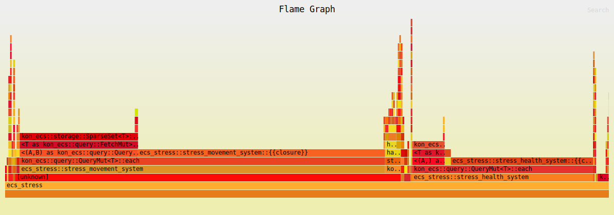
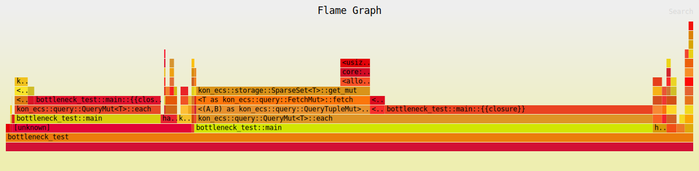

# Kon Engine 🦀

**Kon** is a modular, plugin-based 2D game engine written in Rust. It is built from scratch with a focus on simplicity and a custom SparseSet-based ECS architecture.

> ⚠️ **Note:** This project is currently in the **experimental** stage and is being developed for educational purposes.

**Goal:** To understand how game engines work under the hood, rather than just using them.

## Architecture

The engine is organized as a workspace with independent modules:

### Core (Implemented)
- **`kon_core`**: Application lifecycle, plugin system, and event handling.
- **`kon_ecs`**: Custom Entity-Component-System using generational indices.
- **`kon_macros`**: Procedural macros (`#[system]`, `#[component]`).

### Under Construction 🚧
- **`kon_math`**: Math utilities and data structures (Glam integration) **(WIP)**.
- **`kon_window`**: Window management via Winit **(WIP)**.
- **`kon_input`**: Input state management **(WIP)**.
- **`kon_renderer`**: WGPU-based rendering engine **(WIP)**.
- **`kon_physics`**: 2D Physics engine integration **(Planned)**.
- **`kon_editor`**: Editor UI and tooling **(Planned)**.

## Features

- [x] **Modular Architecture:** Plugin-based design.
- [x] **High-Performance ECS:** Custom SparseSet storage with O(1) bitmask tagging and zero-allocation queries.
- [x] **Ergonomic API:** Write systems as normal Rust functions.
- [x] **Tuple-based Queries:** Type-safe iteration (e.g., `Query<(Pos, Vel)>`).
- [x] **Event Signals:** Decoupled communication between systems.
- [ ] **Windowing:** Context-aware window creation.
- [ ] **Input Handling:** State management for keyboard/mouse.
- [ ] **Rendering:** Hardware accelerated 2D graphics.
- [ ] **Physics:** Collision detection and rigid body dynamics.
- [ ] **Editor:** Integrated development tools.

## Performance Analysis

Kon Engine is architected for maximum throughput. Below are the flamegraphs demonstrating the engine's performance under extreme conditions.

### ECS Stress Test (100k Entities)
This test simulates 100,000 entities being updated by multiple systems. The minimal overhead in `each` calls demonstrates the efficiency of the zero-allocation query system.


*[Click to view interactive version](./assets/ecs_stress_flamegraph.svg)*

### Heavy Component Bottleneck Test
This test uses 10,000 entities with "Heavy" components (100x f32 each). The results show that the engine is memory-bound rather than logic-bound, proving the efficiency of SparseSet storage hoisting.


*[Click to view interactive version](./assets/bottleneck_test_flamegraph.svg)*

## Usage Example

Kon uses a clean, ergonomic API inspired by modern ECS patterns. Here is a simple example:

```rust
use kon::prelude::*;

// 1. Define Components
#[component]
struct Position { x: f32, y: f32 }

#[component]
struct Velocity { x: f32, y: f32 }

// 2. Define Systems
#[system]
fn setup(ctx: &mut Context) {
    // Spawn an entity
    ctx.world_mut()
        .spawn()
        .insert(Position { x: 0.0, y: 0.0 })
        .insert(Velocity { x: 1.0, y: 0.0 })
        .tag("player")
        .id();
}

#[system]
fn movement(ctx: &mut Context) {
    // Query and iterate efficiently
    ctx.world_mut()
        .select_mut::<(Position, Velocity)>()
        .each(|entity, (pos, vel)| {
            pos.x += vel.x;
            pos.y += vel.y;
            println!("{:?} moved to ({}, {})", entity, pos.x, pos.y);
        });
}

// 3. Run the App
fn main() {
    Kon::new()
        .add_plugin(DefaultPlugins)
        .add_startup_system(setup)
        .add_system(movement)
        .run();
}
```

## Getting Started

Since this is currently a workspace project, you can clone the repository and run the examples directly using Cargo:

```bash
# Clone the repository
git clone https://github.com/cey0225/kon.git
cd kon

# Run the query demo
./kon.sh ecs_demo/query_demo

# Run the tag filtering demo
./kon.sh ecs_demo/tag_demo
```

## License

This project is dual-licensed under either:

- MIT License ([LICENSE-MIT](LICENSE-MIT) or [http://opensource.org/licenses/MIT](http://opensource.org/licenses/MIT))
- Apache License, Version 2.0 ([LICENSE-APACHE](LICENSE-APACHE) or [http://www.apache.org/licenses/LICENSE-2.0](http://www.apache.org/licenses/LICENSE-2.0))

at your option.
